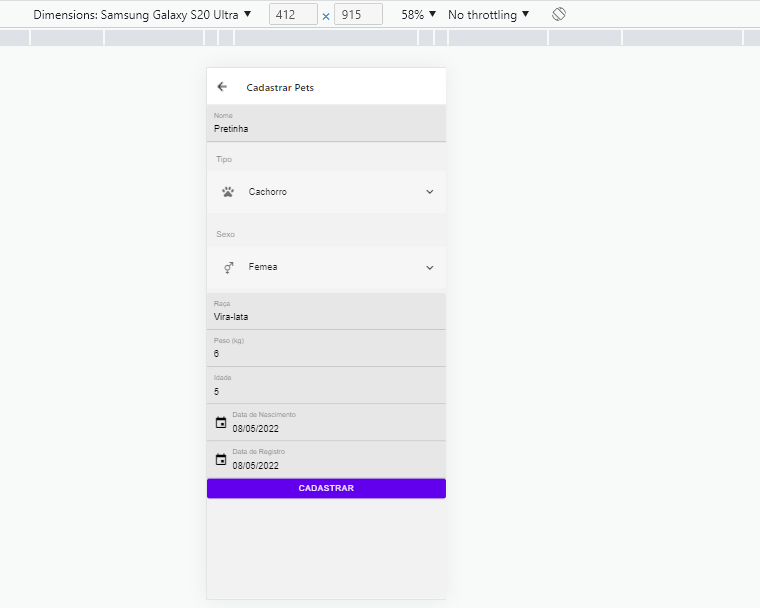

# Programação de Funcionalidades

Pré-requisitos: <a href="2-Especificação do Projeto.md"> Especificação do Projeto</a>, <a href="3-Projeto de Interface.md"> Projeto de Interface</a>, <a href="4-Metodologia.md"> Metodologia</a>, <a href="3-Projeto de Interface.md"> Projeto de Interface</a>, <a href="5-Arquitetura da Solução.md"> Arquitetura da Solução</a>

Implementação do sistema descritas por meio dos requisitos funcionais e/ou não funcionais. Deve relacionar os requisitos atendidos os artefatos criados (código fonte) além das estruturas de dados utilizadas e as instruções para acesso e verificação da implementação que deve estar funcional no ambiente de hospedagem.

Para cada requisito funcional, pode ser entregue um artefato desse tipo

> **Links Úteis**:
>
> - [Trabalhando com HTML5 Local Storage e JSON](https://www.devmedia.com.br/trabalhando-com-html5-local-storage-e-json/29045)
> - [JSON Tutorial](https://www.w3resource.com/JSON)
> - [JSON Data Set Sample](https://opensource.adobe.com/Spry/samples/data_region/JSONDataSetSample.html)
> - [JSON - Introduction (W3Schools)](https://www.w3schools.com/js/js_json_intro.asp)
> - [JSON Tutorial (TutorialsPoint)](https://www.tutorialspoint.com/json/index.htm)

# Evolução do projeto

### Arthur Fernandes: 
  Fui responsavel por implementar a funcionalidade de rotas da aplicação e a parte de listagem de pets cadastrados.
  Tive problemas na parte de integração do react-native com bibliotecas externas para gerar as rotas.
  
  Tela Real
  
  
  
  Tela Figma
  
  
  
  ### Luisa Helena: 
  Nessa etapa fiquei responsável por desenvolver a tela Cadastrar Pets da aplicação.  
  Utilizei o Expo para desenvolver o código inicial da tela e posteriormente migrei para o VS Code. Tive muita dificuldade nessa parte pois foi necessário atualizar diversas dependências.

Link video: https://www.youtube.com/watch?v=bT-hR4o5XTE
  
  Tela Real
  
 
  
  Tela Figma
  
  
  
